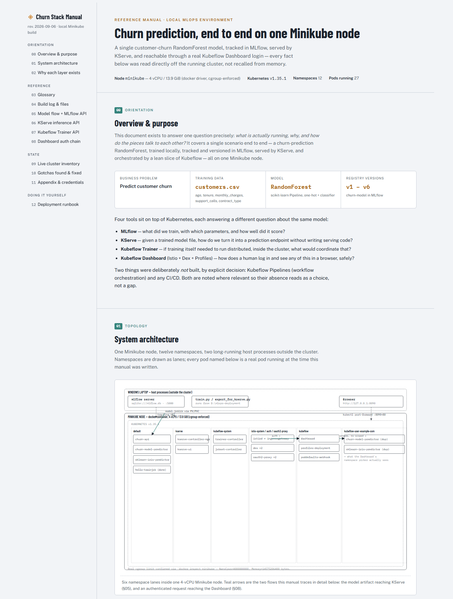
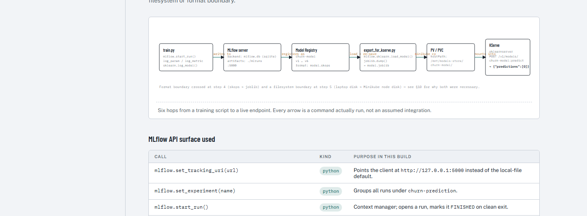
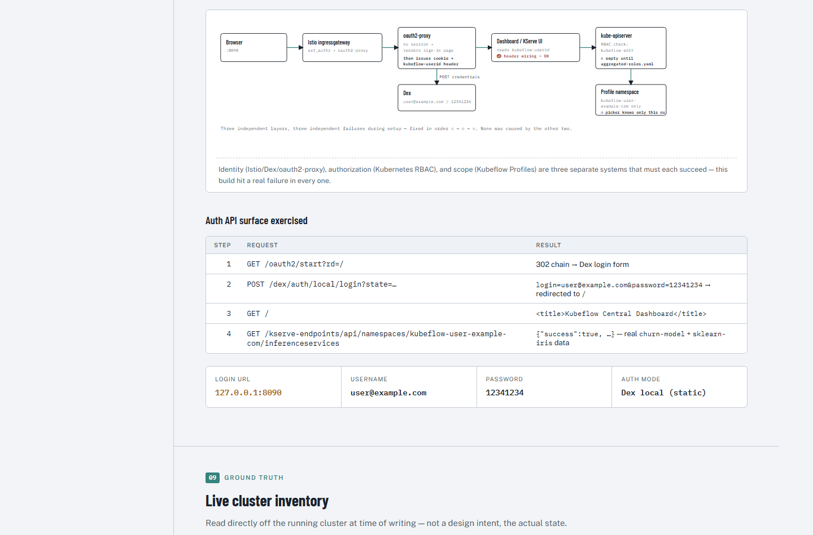
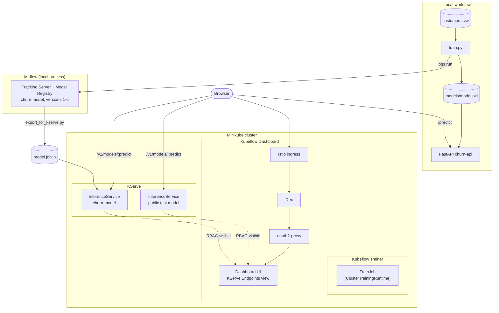

# Customer Churn Prediction

This is a small machine learning application for learning the basic MLOps workflow locally.

It predicts whether a customer may leave a service:

- `0` means the customer stays.
- `1` means the customer leaves.

The application uses Python, pandas, scikit-learn, FastAPI, pytest, and Docker — and is now wired into a full local MLOps stack on top of Kubernetes/Minikube:

- **[MLflow](https://mlflow.org/)** — experiment tracking and a Model Registry (`churn-model`, versions 1–6)
- **[KServe](https://kserve.github.io/website/)** — serves the registered model as a real `InferenceService`, alongside a public test model
- **[Kubeflow Trainer](https://www.kubeflow.org/docs/components/trainer/)** — installed and verified with a real `TrainJob`
- **Kubeflow Dashboard** — a working login (Istio + Dex + oauth2-proxy) with a live KServe Endpoints view

📖 **Documentation**
- [docs/churn-stack-manual.html](docs/churn-stack-manual.html) — full architecture, glossary, API specs, and diagrams
- [docs/SETUP.md](docs/SETUP.md) — step-by-step deployment runbook, stage by stage
- [docs/TROUBLESHOOTING.md](docs/TROUBLESHOOTING.md) — every real gotcha hit, with symptom/cause/fix

| | | |
|---|---|---|
|  |  |  |

## Architecture



Full detail (glossary, API specs, every diagram) in [docs/churn-stack-manual.html](docs/churn-stack-manual.html).

## Project flow

```text
customers.csv
     |
     v
  train.py  ---->  models/model.pkl
                         |
                         v
                    FastAPI API
                         |
                         v
                       Docker
```

## Project structure

```text
mlops-deployment/
├── app/
│   ├── __init__.py
│   └── main.py
├── data/
│   └── customers.csv
├── models/
│   └── model.pkl                    # created by python train.py
├── tests/
│   └── test_api.py
├── train.py
├── export_for_kserve.py             # MLflow registry version -> model.joblib for KServe
├── requirements.txt
├── Dockerfile
├── mlflow/
│   └── README.md                    # MLflow commands (runs as a local process, no k8s)
├── k8s/
│   ├── README.md                    # apply order + what each folder is
│   ├── fastapi/                     # the original churn-api Deployment/Service
│   ├── kserve/                      # InferenceServices, storage PV/PVC, RBAC fix
│   ├── kubeflow-trainer/            # ClusterTrainingRuntime + a verified TrainJob
│   └── kubeflow-dashboard/          # Istio/Dex/oauth2-proxy component selection
├── docs/
│   ├── churn-stack-manual.html      # full architecture manual + diagrams
│   ├── SETUP.md                     # deployment runbook
│   ├── TROUBLESHOOTING.md           # gotchas found & fixed
│   └── screenshots/
├── .dockerignore
├── .gitignore
└── README.md
```

## What is the data?

`data/customers.csv` is a small, understandable dataset. Each row is one customer. The input columns are:

- `age`: customer age
- `tenure`: number of months as a customer
- `monthly_charges`: monthly bill
- `support_calls`: number of support calls
- `contract_type`: `monthly`, `one_year`, or `two_year`
- `churn`: the answer the model learns to predict

The dataset is intentionally small and synthetic. It is for learning, not for making real business decisions.

## What is training?

Training is the offline step where the model learns from examples. Run it with:

```bash
python train.py
```

`train.py` follows these steps:

1. Reads `data/customers.csv` with pandas.
2. Separates the input columns (`X`) from the answer (`y`).
3. Splits the rows into training data and test data. The model learns from the training data, while the test data checks how it works on unseen examples.
4. Encodes `contract_type`. A machine learning model needs numbers, so one-hot encoding turns values such as `monthly` and `two_year` into numeric columns.
5. Creates and trains a `RandomForestClassifier`.
6. Predicts the test rows and prints accuracy.
7. Saves the preprocessing and trained model together in `models/model.pkl`.

The saved file is the result of training. Retraining is not part of an API request.

## What is prediction (inference)?

Prediction, also called inference, is the online step after training. The API receives one new customer's information, applies the same encoding, and asks the saved model for an answer.

The difference is:

- **Training:** learn patterns from historical examples and save a model.
- **Inference:** load the saved model and use it to predict new data.

The API loads the model once when `app/main.py` starts. It does not retrain for every `/predict` request.

## Run locally

Create and activate a virtual environment if you want to keep this project's packages separate:

```bash
python -m venv .venv
```

Windows PowerShell:

```powershell
.venv\Scripts\Activate.ps1
```

Install packages:

```bash
python -m pip install -r requirements.txt
```

Train the model:

```bash
python train.py
```

Start the API:

```bash
uvicorn app.main:app --reload
```

The API runs at `http://127.0.0.1:8000`. FastAPI also provides interactive documentation at `http://127.0.0.1:8000/docs`.

Check health in another terminal:

```bash
curl http://127.0.0.1:8000/health
```

Expected response:

```json
{"status":"healthy"}
```

Send a prediction:

```bash
curl -X POST http://127.0.0.1:8000/predict \
  -H "Content-Type: application/json" \
  -d '{"age":35,"tenure":24,"monthly_charges":75.5,"support_calls":3,"contract_type":"monthly"}'
```

Example response:

```json
{"prediction":1,"churn":true,"probability":0.82}
```

The exact probability can vary if the model or dataset changes.

## Test the API

Make sure the model has been trained first, then run:

```bash
pytest
```

The tests check the healthy response and the shape of a prediction response.

## How the FastAPI code works

`app/main.py` is the web service:

1. `joblib.load(...)` loads the model saved by `train.py`.
2. `Customer` describes the JSON fields a request must contain. FastAPI validates those fields.
3. `GET /health` returns a small status response. This is useful for checking whether the service is running.
4. `POST /predict` changes the request into a one-row pandas DataFrame.
5. The loaded model predicts `0` or `1` and calculates the probability of churn.
6. The endpoint returns the prediction, a readable Boolean, and the probability.

FastAPI is useful here because it turns a Python function into an HTTP API that another application can call.

## Docker

The Dockerfile creates a repeatable environment. It starts with Python, installs `requirements.txt`, copies the application, exposes port `8000`, and starts Uvicorn.

Train the model before building the image so `models/model.pkl` is included:

```bash
python train.py
docker build -t mlops-churn .
docker run -p 8000:8000 mlops-churn
```

Then open `http://localhost:8000/docs`.

## Run on Minikube

Minikube lets you run a small Kubernetes cluster locally. The original app's
manifests are in `k8s/fastapi/`:

- `k8s/fastapi/deployment.yaml` runs one copy of the API container.
- `k8s/fastapi/service.yaml` gives the API a reachable NodePort.

Start Minikube with Docker as its driver:

```bash
minikube start --driver=docker
minikube image load mlops-churn:latest
kubectl apply -f k8s/fastapi/deployment.yaml
kubectl apply -f k8s/fastapi/service.yaml
kubectl get pods
kubectl get services
```

Open the API through Minikube:

```bash
minikube service churn-api --url
```

Use the URL printed by that command to open `/docs` or call `/health`. Check the deployment logs with:

```bash
kubectl logs deployment/churn-api
```

The local image is loaded directly into Minikube, so Kubernetes does not need to download it from Docker Hub.

### Set Docker Desktop memory to 15 GB

Docker Desktop controls this setting, not the project files. In Docker Desktop:

1. Open **Settings**.
2. Open **Resources**.
3. Set **Memory** to `15 GB`.
4. Select **Apply & Restart**.

After Docker Desktop restarts, verify it with:

```bash
docker info
```

## The full MLOps stack

```text
train.py  --logs-->  MLflow (SQLite + ./mlruns)  --registers-->  churn-model v1…v6
                                                                        |
                                                          export_for_kserve.py
                                                                        |
                                                          PV/PVC on the Minikube node
                                                                        |
                                                                    KServe
                                                          (InferenceService, Standard mode)
                                                                        |
                                                          POST /v1/models/churn-model:predict

Kubeflow Trainer  ---  installed, verified with a real TrainJob, not used for this small model
Kubeflow Dashboard  --  Istio + Dex + oauth2-proxy, real login, live KServe Endpoints view
```

- **MLflow** — start with `python -m mlflow server --backend-store-uri sqlite:///mlflow.db --default-artifact-root ./mlruns --host 127.0.0.1 --port 5000`, then `python train.py`. Every run is tracked; `churn-model` auto-versions on each run via `registered_model_name` in `train.py`.
- **KServe** — `k8s/kserve/inference-service-test-model.yaml` (public test model) and `k8s/kserve/churn-inference-service.yaml` (the real model, via `k8s/kserve/churn-model-storage.yaml`'s PV/PVC) run in **Standard/RawDeployment mode** — no Istio or Knative required for serving itself.
- **Kubeflow Trainer** — `k8s/kubeflow-trainer/simple-training-runtime.yaml` + `hello-trainjob.yaml` prove the controller works end to end.
- **Kubeflow Dashboard** — the heavier, optional piece: Istio + Dex + oauth2-proxy + Profiles (`k8s/kubeflow-dashboard/`), needed only because the Dashboard has no supported standalone mode.

None of this is simulated — every command, API response, and screenshot in [docs/churn-stack-manual.html](docs/churn-stack-manual.html) came from actually running it. [docs/SETUP.md](docs/SETUP.md) has the exact, ordered, mistake-proofed command sequence to reproduce all of it; [docs/TROUBLESHOOTING.md](docs/TROUBLESHOOTING.md) covers the seven real gotchas hit along the way (Windows console encoding, MLflow's `.skops` vs `.joblib` format, KServe's array-vs-DataFrame input, and more).

Deliberately not implemented, by decision: Kubeflow Pipelines, CI/CD, Prometheus/Grafana, and any multi-node distributed training.
